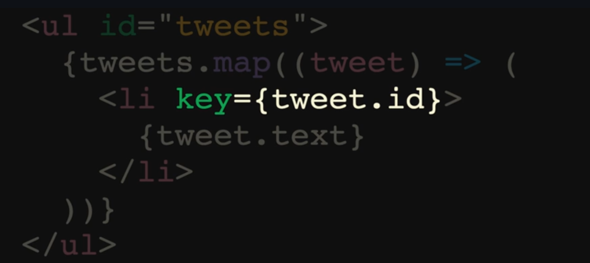

# notes générales sur React

## .map()



- Dans React, lors de la création d'une liste d'éléments, il est recommandé d'attribuer une clé unique à chaque élément. Cela permet à React d'optimiser le rendu en ne mettant à jour que les éléments qui ont changé plutôt que de re-rendre toute la liste. Cela améliore les performances, surtout pour les grandes listes.

## Les Props

### les props sont aux composants ce que les arguments sont aux fonctions !

avec destructuration

```jsx
function Welcome({ name }) {
  return <h1>Bonjour, {name}</h1>;
}
```

ou sans

```jsx
function Welcome(props) {
  return <h1>Bonjour, {props.name}</h1>;
}
```

avec tsx ce serait comme ceci

```tsx
type WelcomeProps = {
  name: string;
};

function Welcome({ name }: WelcomeProps) {
  return <h1>Bonjour, {name}</h1>;
}
```

ou

```tsx
function Welcome(props: WelcomeProps) {
  return <h1>Bonjour, {props.name}</h1>;
}
```

## la gestion d'éléments

### il est courant de nommer `handle...` le nom de sa fonction qui utilisera un event Handler en React

Voici une liste de quelques événements couramment utilisés en React qui peuvent être gérés avec des fonctions handle... :

- onClick: Déclenché lorsqu'un utilisateur clique sur un élément.
- onChange: Déclenché lorsqu'un utilisateur change la valeur d'un champ de - formulaire.
- onSubmit: Déclenché lorsqu'un formulaire est soumis.
- onFocus: Déclenché lorsqu'un élément reçoit le focus.
- onBlur: Déclenché lorsqu'un élément perd le focus.
- onMouseOver: Déclenché lorsqu'un utilisateur passe la souris sur un - élément.
- onMouseOut: Déclenché lorsqu'un utilisateur déplace la souris hors d'un - élément.
- onKeyDown: Déclenché lorsqu'un utilisateur appuie sur une touche.
- onKeyUp: Déclenché lorsqu'un utilisateur relâche une touche.
- onLoad: Déclenché lorsque la page a fini de charger.
- onScroll: Déclenché lorsqu'un utilisateur fait défiler la page.

#### Chaque événement peut être géré avec une fonction handle... qui est - déclenchée lorsque l'événement se produit. Par exemple, handleClick, - handleChange, handleSubmit, etc.
